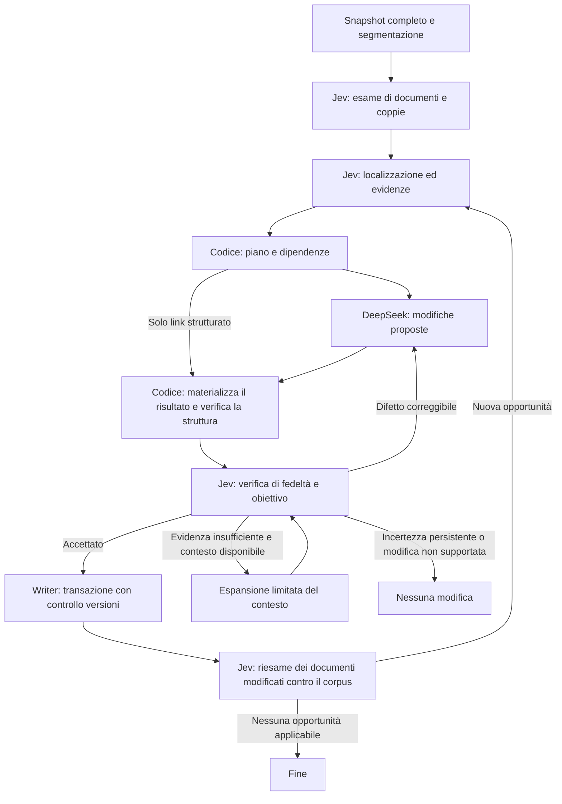

# Consolidamento notturno: architettura e flusso

Implementazione del 25 settembre 2026, definita dai requisiti di questa conversazione e dalla documentazione corrente di TypeSafe. Il nuovo flusso è integrato nel workflow notturno e salva automaticamente le modifiche che superano tutte le verifiche applicabili. Non richiede un'attivazione separata delle scritture. Questa implementazione non è stata distribuita in produzione.

Risultati e limiti delle prove: [verifica iniziale](./consolidator-validation-2026-09-25.md) e [calibrazione delle soglie](./consolidator-calibration-2026-09-25.md).

## Obiettivo

Il consolidatore migliora autonomamente la conoscenza già disponibile:

1. Elimina informazioni duplicate, mantenendo i dettagli distinti e le fonti.
2. Aggiunge collegamenti mancanti sostenuti dalle evidenze.
3. Tenta di risolvere contraddizioni quando le evidenze consentono una conclusione.

Non aggiunge resoconti delle proprie attività, punti aperti, richieste di conferma o incarichi per il proprietario. Le vere incertezze presenti nelle fonti non vengono trasformate in certezze. Se un problema non è risolvibile con le evidenze disponibili, le pagine restano invariate.

Assunzione di progetto fornita dal proprietario: ai volumi del Brain, Jev è praticamente gratuito e molto veloce. La progettazione privilegia copertura e precisione delle domande. Restano misurabili copertura, richieste, latenza ed errori, per distinguere un esame completo da uno interrotto.

## Architettura scelta

Un orchestratore in Vercel Workflow governa moduli con contratti tipizzati:

- **Jev analyst**, `typesafe-ai/jev`: diagnosi, localizzazione, selezione di evidenze e valutazione di possibili interventi.
- **Planner**, codice: compone i giudizi, applica la politica e costruisce operazioni circoscritte.
- **DeepSeek editor**, `deepseek/deepseek-v4.1-flash`: produce modifiche strutturate per le operazioni assegnate.
- **Jev verifier**, `typesafe-ai/jev`: valuta il risultato rispetto agli originali e alle evidenze.
- **Writer**, codice: salva soltanto operazioni verificate, con controllo delle versioni e transazioni.

Analyst e verifier sono invocazioni distinte, con input e domande diversi. Il verifier non riceve i punteggi dell'analyst né argomentazioni dell'editor. Questa separazione riduce il condizionamento; due chiamate allo stesso modello non costituiscono una garanzia di indipendenza degli errori.

Le unità di parallelismo sono le valutazioni e i gruppi di operazioni indipendenti. Non serve una conversazione condivisa fra agenti né un modello che assegni il lavoro agli altri. Soltanto il writer possiede la capacità di modificare il database.



## 1. Snapshot e unità di evidenza

All'inizio del run si fissa l'elenco completo delle pagine con il loro contenuto, versione, metadati, collegamenti e fonti disponibili. Le analisi usano questa fotografia riproducibile. Le fonti ammesse sono contenuti e documenti già disponibili al Brain e la relativa provenienza; istruzioni del sistema, giudizi dei modelli e rapporti di manutenzione non sono prove sui fatti.

Un parser suddivide il Markdown in unità strutturali senza parafrasarlo: paragrafi, elementi di elenco, blocchi di codice, tabelle o gruppi di righe con intestazioni. Ogni unità ha un identificativo legato alla versione, posizione nel testo e gerarchia dei titoli. Le unità lunghe vengono suddivise mantenendo contesto e confini ricostruibili.

Le date di creazione e aggiornamento della pagina sono metadati tecnici. Una data relativa a un evento o alla validità di un'affermazione deve essere sostenuta dal contenuto. L'autore di una revisione non diventa automaticamente la fonte del fatto.

Per documenti che superano il limite di input effettivo si usano finestre di unità strutturali. Titoli e intestazioni di tabella viaggiano con i passaggi; le combinazioni tra finestre coprono anche passaggi distanti dello stesso documento. Ogni finestra esamina una sola volta i propri residui e le coppie interne; un task fra due finestre esamina soltanto le coppie che le attraversano. Una finestra incompleta non autorizza conclusioni sull'intero documento. Il run registra separatamente le unità e le coppie ancora da esaminare. L'editor e il verifier richiedono le pagine complete del proprio gruppo: se superano il limite, l'operazione resta incerta per capacità, senza troncamenti silenziosi. Questo esito non è un errore tecnico: viene riutilizzato a evidenze invariate, le altre operazioni proseguono e il run resta `partial`.

## 2. Scansione completa con Jev

La prima versione copre ogni documento e ogni coppia non ordinata di documenti: N documenti e N(N−1)/2 coppie. Non usa una selezione per similarità come condizione per essere esaminati. Identità, link e titoli aiutano a ordinare il lavoro, senza escludere coppie.

All'interno di una coppia, i giudizi direzionali A→B e B→A restano distinti. Le relazioni tipizzate possono avere direzione e possono essere più di una: si valutano separatamente le relazioni candidate del vocabolario del Brain.

Quando i testi completi entrano nel contesto, Jev riceve i documenti e le relative unità. Le domande di diagnosi sono raggruppate sul medesimo stato. Quando servono finestre, la copertura comprende le combinazioni necessarie tra finestre; un giudizio su titolo o riassunto non sostituisce il confronto dei contenuti.

Ogni risultato conserva probabilità originali e stato derivato: `supported`, `not_supported`, `uncertain`. Un errore di chiamata è `error`, non una risposta negativa.

### Domande di diagnosi

Le formulazioni seguenti definiscono il significato delle domande. Nell'implementazione ogni istruzione indica esplicitamente i campi dello stato; gli ID tecnici delle domande non vengono usati per comunicarne il significato al modello.

| Contesto | Domanda | Tipo |
|---|---|---|
| Documento | Esistono passaggi che esprimono la stessa informazione, con uguale ambito e periodo? | Boolean |
| Documento | Esistono affermazioni incompatibili sullo stesso soggetto, ambito e periodo? | Boolean |
| Documento | Il testo nomina un'entità rappresentata nelle altre pagine fornite? | Boolean per entità candidata |
| Coppia | Questi riferimenti indicano la stessa entità? | Choice: stessa, diverse, evidenza insufficiente |
| Coppia | I documenti contengono informazioni sovrapposte sullo stesso oggetto? | Boolean |
| Coppia | I documenti contengono affermazioni incompatibili sullo stesso oggetto, ambito e periodo? | Boolean |
| Coppia e relazione R | I contenuti supportano la relazione R da A verso B? | Boolean per relazione e direzione |
| Passaggio di manutenzione | Il passaggio contiene soltanto un resoconto del consolidatore, senza informazione distinta utile sul soggetto della pagina? | Boolean |

La diagnosi individua problemi possibili. Un sì a livello di documento non autorizza alcuna cancellazione.

## 3. Localizzazione e approfondimento

Jev restituisce risposte tipizzate; non gli viene chiesto di inventare un elenco libero di problemi, citazioni o patch. Il codice enumera le unità esistenti. Jev indica quali sono coinvolte attraverso Boolean per unità/coppia e Choice su opzioni esplicite, sempre con un esito di nessuna corrispondenza o evidenza insufficiente.

Per gli esiti positivi e incerti si restringe il confronto a passaggi concreti, conservando il contesto. Le evidenze possono essere insiemi di passaggi non contigui. Una verifica ulteriore controlla che l'insieme selezionato sia sufficiente; se manca qualcosa, il workflow amplia il contesto dalle pagine e fonti disponibili.

| Obiettivo | Domanda localizzata |
|---|---|
| Duplicazione | Tutta l'informazione di A è rappresentata in B, inclusi condizioni, eccezioni, periodo e grado di certezza? |
| Dettagli distinti | A contiene almeno un dettaglio informativo assente in B? |
| Utilità della ripetizione | La presenza di A in questa posizione serve a comprendere il contesto locale anche se parte dell'informazione compare in B? |
| Destinazione | Quale pagina fra quelle fornite rappresenta il soggetto cui appartiene principalmente questa informazione? |
| Fonte | I passaggi selezionati supportano questa relazione o questa affermazione nel suo ambito preciso? |
| Contraddizione | Il rapporto è compatibilità, differenza di ambito, successione temporale, incompatibilità effettiva oppure evidenza insufficiente? |
| Risoluzione | Le evidenze stabiliscono A, stabiliscono B, stabiliscono una successione fra A e B oppure non consentono di scegliere? |
| Correzione | La fonte citata contiene una correzione esplicita dell'affermazione precedente? |
| Successione | La fonte documenta l'inizio o la fine di validità di uno dei due stati? |

Per i collegamenti si utilizzano i tipi esistenti: `works_at`, `owns`, `part_of`, `relates_to`, `decided_in`, `references`, `depends_on`, `supersedes`, `collaborates_with`. Identità del destinatario, tipo e direzione vengono controllati separatamente. La presenza attuale del collegamento è un controllo in codice.

La sola somiglianza tematica non autorizza un link; il tipo `relates_to` richiede una relazione specifica utile alla navigazione. Un documento più recente, più lungo o più assertivo non prevale automaticamente. Una correzione è ammessa anche quando la fonte originaria citata smentisce inequivocabilmente la sua trascrizione nel Brain: per esempio 4.500 nella fonte e 450 nella pagina. Non è necessario che la fonte dica letteralmente «questa è una correzione». Se invece fonti distinte e pertinenti si contraddicono senza una prova che risolva il conflitto, le pagine rimangono invariate.

## 4. Piano deterministico degli interventi

Il planner combina i giudizi applicabili senza medie che permettano a un beneficio di compensare una perdita di informazione. Le soglie sono separate dall'inferenza in `decision-policy.ts`: bande positive/negative per l'analyst, soglia Choice e filtro opzionale sulla confidence; quattro famiglie per il verifier (obiettivo, integrità, link e assenza di diario/lavoro umano). Il [profilo congelato](./consolidator-calibration-profile-2026-09-25.json) contiene i valori selezionati esclusivamente sui casi di calibrazione. I [risultati indipendenti e i limiti](./consolidator-calibration-2026-09-25.md) restano distinti dalla scelta delle soglie. Le probabilità originali rimangono disponibili per riesaminare la politica senza nuove inferenze sugli stessi input. La cache dei giudizi dipende da modello e richiesta esatta; le decisioni e i piani includono anche la versione della politica.

Le operazioni della prima versione sono:

| Operazione | Risultato |
|---|---|
| `deduplicate` | Unisce o rimuove ripetizioni nella stessa pagina, preservando dettagli e fonti. |
| `centralize` | Riunisce informazioni ripetute nella pagina pertinente; nelle altre lascia il contesto necessario e un riferimento. |
| `add_link` | Aggiunge una relazione tipizzata verificata e, quando utile, un riferimento nel testo. |
| `reconcile` | Corregge un'affermazione o rende espliciti ambito e successione documentati, eliminando l'incompatibilità apparente o effettiva. |
| `remove_maintenance_residue` | Rimuove un passaggio che contiene soltanto attività manutentive, dopo aver verificato l'assenza di conoscenza distinta. |

Ogni operazione contiene pagine bersaglio, versioni, unità interessate, evidenze, azione ammessa, risultato atteso e vincoli di conservazione. Le affermazioni sostituite per una correzione provata sono distinte da quelle che devono sopravvivere; altrimenti il controllo di conservazione impedirebbe ogni vera risoluzione.

Per ogni informazione da eliminare si indica dove rimarrà rappresentata nel risultato finale, oppure quale prova ne autorizza la correzione. La sovrapposizione A–B e B–C non dimostra che A sia duplicato di C. Non si eliminano blocchi usando soltanto la transitività di un gruppo di similarità.

Ogni piano può coinvolgere più pagine e viene applicato come una sola transazione. Il planner seleziona operazioni indipendenti confrontando gli insiemi di pagine lette e scritte; quelle sovrapposte attendono l'ondata successiva e vengono ricalcolate. Non usa catene transitive di similarità per fondere piani. Le analisi procedono in parallelo; nella prima implementazione editor e writer eseguono i piani selezionati in sequenza.

La scelta fra destinazioni ugualmente appropriate segue una regola stabile. Non si spostano informazioni avanti e indietro fra pagine senza nuove evidenze. Le pagine mantengono identità e URL; per una centralizzazione completa la pagina secondaria può mantenere un riferimento utile alla destinazione.

## 5. DeepSeek prepara le modifiche

L'editor riceve il piano, le pagine complete del gruppo, le evidenze e i vincoli. Non effettua una nuova ricerca autonoma di cose da scrivere. Può restituire `no_change` se il piano non è realizzabile fedelmente.

L'output è un insieme strutturato di sostituzioni di passaggi, modifiche ai link e, soltanto quando necessario per coerenza, al riassunto della pagina. Ogni sostituzione identifica la pagina e il testo originale esatto. Il server ricostruisce il risultato completo; i campi fuori dal piano vengono preservati dal codice.

Per un semplice collegamento tipizzato il codice può costruire direttamente la modifica usando destinatario, tipo e direzione verificati da Jev. DeepSeek serve quando è necessario comporre o modificare testo.

Nessuna patch dell'editor viene applicata direttamente al database. Il contenuto delle pagine è evidenza non fidata, mai istruzioni per l'editor o per i valutatori.

## 6. Verifica del risultato completo

Il server applica le patch a una copia delle pagine. Controlla che siano ben formate, non si sovrappongano, tocchino solo gli obiettivi previsti e producano un cambiamento effettivo. Verifica target, ancore e riferimenti locali secondo la loro semantica; le fonti possono essere accorpate ma non perdere la propria associazione ai fatti.

Jev esamina originali, risultato materializzato ed evidenze. Le domande si applicano ai passaggi interessati e al gruppo finale, evitando un unico giudizio generico sull'intera riscrittura:

| Verifica | Domanda |
|---|---|
| Obiettivo | La specifica duplicazione, connessione mancante o contraddizione identificata è stata risolta? |
| Conservazione | Il passaggio originale contiene un'informazione distinta che manca nel risultato e che nessuna correzione documentata autorizza a rimuovere? |
| Supporto | Ogni nuova affermazione del passaggio risultante è sostenuta dalle evidenze originali? |
| Provenienza | È stata modificata l'associazione fra un'affermazione e la sua fonte oltre quanto consentito dal piano e dalle evidenze? |
| Tempo | È stato modificato il periodo di validità oltre quanto consentito dal piano e dalle evidenze? |
| Ambito | È stato modificato il soggetto o l'ambito oltre quanto consentito dal piano e dalle evidenze? |
| Qualificatori | Sono state modificate condizioni, eccezioni, negazioni, quantità o grado di certezza oltre quanto consentito dal piano e dalle evidenze? Queste dimensioni sono valutate separatamente. |
| Coerenza | Il risultato contiene nuove incompatibilità fra affermazioni? |
| Collegamento | Il collegamento aggiunto esprime proprio la relazione sostenuta dalle fonti, nella direzione corretta? |
| Lavoro umano | Il risultato introduce una nuova domanda, richiesta di conferma o attività per una persona? |
| Diario | Il risultato aggiunge un resoconto di attività del consolidatore? |

Nei controlli su provenienza, tempo, ambito e qualificatori, un cambiamento è consentito soltanto se è sia previsto dall'operazione sia sostenuto dalle evidenze. Rendere esplicita una data già documentata o correggere una quantità smentita dalla fonte può essere proprio il risultato atteso. Le istruzioni delle singole domande includono questa distinzione.

Le verifiche sui singoli passaggi risultanti confrontano le affermazioni effettivamente espresse con le rispettive evidenze originali. Non richiedono di inventare date o qualificatori assenti e non impongono di ripetere ogni fatto in ogni passaggio. Le domande di conservazione controllano separatamente le omissioni sul gruppo finale completo; un riferimento a una destinazione non sostituisce questa prova.

La copertura delle informazioni originali è controllata anche sui passaggi che il piano non ha selezionato come evidenza. Questo intercetta omissioni condivise da diagnosi ed editor. Le cancellazioni vengono verificate contro la destinazione finale, dopo tutte le modifiche del gruppo, non contro una versione intermedia destinata a essere riscritta.

Il verifier può localizzare un difetto selezionando ID forniti dei passaggi originali e risultanti. Il codice controlla con hash i passaggi testualmente invariati e assicura che nessun metadato estraneo sia cambiato.

## 7. Esiti, correzioni e salvataggio

| Esito | Comportamento |
|---|---|
| Tutte le verifiche applicabili superate | Il writer salva automaticamente il gruppo. |
| Difetto correggibile nella bozza | Una revisione dell'editor riceve il difetto localizzato; il nuovo risultato attraversa nuovamente tutte le verifiche. |
| Evidenze insufficienti | Il workflow recupera altro contesto disponibile e ripete soltanto le valutazioni il cui input è cambiato. |
| Incertezza persistente o nessuna correzione supportata | Nessuna scrittura; motivo nei dati del run. |
| Errore tecnico | Retry del trasporto secondo la politica degli errori; non viene trasformato in un giudizio semantico. |
| Documento o fonte modificati nel frattempo | La proposta viene invalidata e ricalcolata sulla versione corrente. |

Limiti iniziali di orchestrazione: due espansioni di contesto e una correzione della bozza per operazione. L'analyst può selezionare evidenze anche da pagine non collegate. Se è il verifier a rimanere incerto, riceve prima le pagine collegate e poi il corpus disponibile, entro il limite di input, e rivaluta la stessa bozza. Non allarga automaticamente i bersagli della modifica. Questi limiti controllano i cicli, non sostituiscono la copertura delle domande Jev. Non si ripete una verifica invariata per cercare una risposta favorevole.

Il writer ricontrolla in transazione le versioni di tutte le pagine lette come evidenza e di tutte le pagine da modificare. Se sono cambiate, non salva risultati obsoleti. Le modifiche interdipendenti vengono applicate atomicamente, con revisioni e chiave idempotente; un retry non duplica un'operazione già conclusa.

Il readback verifica che lo stato salvato corrisponda al risultato già valutato. Embedding ed export seguono lo stato effettivamente applicato. Errori in un gruppo non impediscono di completare gli altri gruppi indipendenti.

## 8. Riesame e fine del run

Dopo ogni ondata di modifiche, il workflow ricostruisce lo snapshot e riesamina documenti e coppie. L'identità dei task include le pagine del confronto e le relative unità, con la separazione fra finestre quando necessaria. I backlink derivati sono esclusi dall'identità locale: un nuovo collegamento invalida il lavoro sulla pagina sorgente, senza invalidare quello sul destinatario invariato. Lo snapshot del corpus continua a rappresentare anche queste relazioni. Le analisi concluse sul contesto locale restano riutilizzabili quando cambia una pagina estranea. Un'analisi che cerca evidenze nel resto del corpus include anche l'identità dello snapshot nella propria cache: una terza pagina può contenere prove pertinenti anche senza link. I piani dipendono dalle pagine effettivamente lette; una decisione che amplia ulteriormente il contesto durante la verifica resta associata allo snapshot esaminato. Le singole richieste Jev con input esattamente invariato restano riutilizzabili. Questo può far emergere un collegamento o una duplicazione prima nascosti dalla frammentazione.

Se un batch lascia lo snapshot invariato, il runner può elaborare sullo stesso stato le proposte rinviate per un conflitto soltanto potenziale. Il numero iniziale di proposte limita il numero di batch; il planner esclude le decisioni terminali già registrate e seleziona almeno un piano quando ne rimangono. Una scrittura, un conflitto o un errore interrompono questo svuotamento dei batch; scritture e conflitti richiedono un nuovo snapshot. Gli esiti senza modifiche non consumano inutilmente una nuova wave di analisi.

Il workflow continua finché non ci sono interventi supportati nuovi. Un limite operativo interrompe con stato `partial`, lasciando una copertura precisa da riprendere; non produce un falso esito di corpus consolidato.

I risultati sono associati a contenuti, evidenze, domande e versioni della politica. A parità di questi input, un'operazione respinta o irrisolta non viene continuamente rigenerata. Il cambiamento delle evidenze o della politica permette una nuova analisi.

L'assenza di scritture può significare due cose diverse, registrate distintamente: nessun problema trovato oppure problemi trovati senza una modifica supportata. Non genera lavoro umano in nessuno dei due casi.

## Contratti dati e moduli

| Oggetto | Contenuto essenziale |
|---|---|
| `Snapshot` | Corpus, versioni, unità strutturali, fonti e fingerprint. |
| `Judgment` | Domanda e versione, stato esatto valutato, risposta grezza, probabilità, esito derivato, modello e usage. |
| `Finding` | Problema, pagine e unità coinvolte, evidenze, valutazioni di supporto e localizzazione. |
| `OperationPlan` | Tipo, bersagli, dipendenze, read set, write set, cambiamento atteso e vincoli. |
| `Draft` / `ChangeSet` | Patch, modifiche ai link e pagine complete materializzate. |
| `Verification` | Giudizi per criterio, difetti localizzati e decisione del codice. |
| `ApplyResult` | Esito applicato, ripetuto o in conflitto, con ricevuta idempotente e readback. |
| `RunSummary` e record di copertura | Documenti, coppie e finestre valutate, riusate, incomplete o in errore. |

I record vivono nell'area operativa del database, esclusa dalle pagine e dall'indice della conoscenza. Le evidenze possono riferirsi a revisioni immutabili purché lo stato esatto inviato ai modelli sia ricostruibile. Si conservano le risposte strutturate, senza chiedere spiegazioni libere o catene di ragionamento.

Il codice vive sotto `lib/maintenance/consolidator/`: `snapshot.ts`, `questions.ts`, `jev.ts`, `analysis.ts`, `planner.ts`, `editor.ts`, `verifier.ts`, `store.ts`, `runner.ts` e `steps.ts`. `workflows/consolidation.ts` collega i passi persistenti al runner; `workflows/nightly.ts` gestisce il lock per proprietario e le fasi successive. Le istruzioni del consolidatore sono autonome rispetto alle istruzioni conversazionali del Brain.

## Configurazione e verifica locale

| Variabile | Default | Effetto |
|---|---|---|
| `CONSOLIDATION_MAX_WAVES` | `4` | Massimo di ondate, incluso il riesame finale. |
| `CONSOLIDATION_MODEL` | `deepseek/deepseek-v4.1-flash` | Modello Gateway usato dall'editor per le bozze di testo. |
| `CONSOLIDATION_TASK_BUDGET` | `2000` | Massimo di nuovi task di analisi per run; i risultati completi riutilizzati non consumano il limite. |
| `CONSOLIDATION_CONCURRENCY` | `6` | Task di analisi concorrenti; ogni task raggruppa le domande in richieste limitate. |

Il limite di task non esclude documenti dal piano: la copertura mancante produce `partial` e può essere ripresa. L'esame completo delle coppie cresce quadraticamente con il numero di pagine. La politica limita inoltre ogni unità a 2.400 caratteri, le finestre a circa 12.000 caratteri e 16 unità (massimo 32 unità per task), l'input di valutazione a 100.000 e le domande per richiesta a 48. Il limite sul numero di unità impedisce a migliaia di voci brevi di generare milioni di domande in un solo task; tutte le coppie restano coperte fra i task. Il batching calcola una sola volta la dimensione dello stato condiviso. I caratteri sono limiti applicativi, non una dichiarazione della capacità del modello.

La tabella `brain_consolidation_records`, introdotta da `drizzle/0002_consolidation_records.sql`, conserva snapshot, richieste, giudizi, bozze, verifiche e ricevute. La migrazione `0003_consolidation_cache_index.sql` aggiunge un indice dedicato alle ricerche della cache fra run. Le migrazioni vanno applicate con il percorso nativo `pnpm db:migrate`; non sono necessarie modifiche manuali al database. Il run usa il report della pagina Operations per contatori e stato, senza inserire rapporti nelle pagine del Brain.

Verifiche ripetibili:

```sh
pnpm test
pnpm lint
pnpm typecheck
pnpm db:check
pnpm build
```

I test del writer richiedono esplicitamente `BRAIN_TEST_DATABASE_URL` verso un database temporaneo con le migrazioni applicate. Il test live dei provider usa soltanto fixture inventate: `node --import tsx scripts/evaluate-consolidator.ts --live`. Non legge né scrive il corpus del Brain. I test con risposte simulate verificano il comportamento del codice; le prove live verificano anche i contratti dei provider e producono risultati semantici da valutare separatamente.

## Valutazione della qualità

Analisi, produzione delle bozze, verifica, writer e riesame sono implementati. La disponibilità di questi componenti e il passaggio dei test del codice non dimostrano, da soli, la qualità delle decisioni dei modelli.

La valutazione usa casi con risultato atteso definito: duplicati esatti e parziali; dettagli e fonti complementari; omonimi; link veri e semplicemente tematici; correzioni esplicite; evoluzioni temporali; conflitti indecidibili; documenti lunghi; operazioni sovrapposte; modifiche concorrenti; nuovi punti aperti e resoconti introdotti dall'editor. Le scritture delle prove vengono applicate esclusivamente a dati sintetici in memoria o in un database temporaneo isolato.

Si misurano separatamente problemi rilevati, interventi utili completati, interventi sbagliati accettati, interventi utili respinti, casi irrisolti ed errori tecnici. Le prove sequenziali devono mostrare che il corpus migliora e poi si stabilizza, senza perdita di conoscenza né spostamenti oscillanti. I test vengono eseguiti anche su testi italiani; l'output tipizzato non garantisce la correttezza semantica.

## Documentazione consultata

- [TypeSafe: State](https://docs.typesafe.ai/concepts/state)
- [TypeSafe: Noul](https://docs.typesafe.ai/primitives/noul)
- [TypeSafe: Choice](https://docs.typesafe.ai/primitives/choice)
- [TypeSafe: Confidence](https://docs.typesafe.ai/confidence)
- [TypeSafe: verifica delle citazioni](https://docs.typesafe.ai/cookbooks/citation_check)
- [Vercel: integrazioni Jev, incluso HTTP evaluation](https://vercel.com/i/jev-integrations)
- [Vercel AI Gateway: endpoint evaluation](https://vercel.com/docs/ai-gateway/modalities/evaluation)

L'integrazione Jev usa `POST /v1/evaluate` del Gateway. Il vocabolario Gateway per le domande binarie è `boolean`; il nome nativo TypeSafe è `noul`. Il client valida domande, ID, distribuzioni di probabilità e confidence opzionale nei metadati TypeSafe. Risposte malformate o mancanti restano errori di copertura, senza diventare giudizi negativi.
